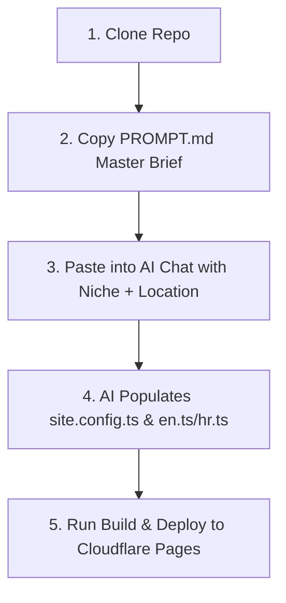

# Premium Local SEO Rank-and-Rent Boilerplate (Astro 4 + Tailwind CSS v4)

A production-grade, highly optimized, **config-driven static site generator** built with **Astro 4** and **Tailwind CSS v4**. This boilerplate is designed specifically for Rank-and-Rent workflows: clone, configure a single `site.config.ts` file, and deploy to create beautiful, $10k-quality local business websites for any niche + location combination.

With built-in support for dual-language setups (EN + HR), full JSON-LD schema coverage (FAQPage/HowTo emitted from visible content), hreflang with translated slugs, dynamic sitemaps with per-URL alternates, dynamic robots.txt + llms.txt, niche theme presets, an i18n content-block system (all page copy lives in locale files — no template edits per niche), zero-backend lead delivery via formsubmit.co, scroll-reveal animations, and AEO components (short-answer blocks, pros/cons, comparison tables, count-up stats, galleries, before/after sliders), this boilerplate is fully prepared to be used by AI coding assistants (like Cursor, Claude, or Copilot) with the included `PROMPT.md` master brief. Minimal client-side JS (vanilla, no framework runtime) keeps Core Web Vitals green.

---

## 🚀 The 30-Minute Clone & Launch Workflow

This boilerplate is designed for ultra-fast deployment. By combining a single-file configuration with AI-ready prompts, you can go from zero to a live, premium local business site in under 30 minutes:



1. **Clone the Repository:**
   ```bash
   git clone https://github.com/dafidkaa/local-seo-rank-rent-boilerplate.git my-niche-site
   cd my-niche-site
   npm install
   ```

2. **Configure Niche & Location:**
   - Open `PROMPT.md` in the root of the project.
   - Copy the entire prompt.
   - Paste it into **Cursor** (using Composer/Agent mode) or **Claude Projects**.
   - Specify your target **Niche** (e.g., Plumbing, Towing, Roofing, Dental), **Location** (e.g., Austin TX, Zagreb HR), and **Languages** (EN, HR, or both).

3. **AI Generation:**
   - The AI will read the corresponding niche design brief (e.g., `DESIGN-construction.md` for roofing, `DESIGN-beauty.md` for dental).
   - It will automatically rewrite `src/site.config.ts` and `src/i18n/en.ts` (and `hr.ts` if dual-language) — including the `blocks:` content sections that hold ALL page body copy — with highly relevant, 1,500-word density, localized copywriting, and Unsplash photography URLs.

4. **Verify & Build:**
   ```bash
   npm run build
   ```
   The static build generates **140+ highly optimized pages** in seconds with **0 errors and 0 warnings**.

5. **Deploy:**
   - Connect the repository to **Cloudflare Pages** or **Vercel**.
   - Your premium local SEO site is live!

---

## 🛠️ Tech Stack & Architecture

| Technology | Purpose | Key Benefits |
|---|---|---|
| **Astro 4** | Static Site Generator (SSG) | HTML-first, ultra-fast builds, zero client-side JS runtime by default. |
| **Tailwind CSS v4** | Utility-First CSS Framework | Lightning-fast compilation, modern CSS-first configuration, native CSS variables. |
| **TypeScript** | Type-Safe Architecture | Safe refactoring, strict config auto-completion, and error-free build checks. |
| **Flat i18n System** | Dual-Language Translation | Flat JSON files (`en.ts`, `hr.ts`) easily populated by AI without nested syntax errors. |
| **Cloudflare Pages** | Hosting & CI/CD | Free global CDN hosting, instant edge cache, and automated GitHub deployments. |

---

## 🎨 Design System & Theme Engine

The visual layer is **driven entirely by the niche theme preset** — change one line and the whole site (colors, fonts, corner language, button shape, navigation treatment, photo overlays, shadows) re-skins itself. Nothing is hardcoded in templates; every surface, border, shadow, and overlay is derived from the brand colors at build time via `color-mix`.

*   **17 niche theme presets** (`src/lib/themes.ts`) — `home-services`, `medical`, `legal`, `beauty`, `real-estate`, `automotive`, `construction`, `cleaning`, `landscaping`, `pet-care`, `fitness`, `education`, `transportation`, `security`, `events`, `funeral`, `luxury`. Spread one into `brand` and override what you need.
*   **Theme personality** — each preset carries `personality: { radius, button, nav }` that drives site-wide corner radii (`sharp`/`soft`/`round`), CTA fill (`solid`/`gradient`), and navigation treatment.
*   **Two navigation treatments** — `solid` (utility bar + glass sticky header) for trades, or `overlay` (transparent header embedded **inside the hero**, turning glass on scroll) for premium/visual niches.
*   **Clean dark surfaces vs. image overlays** — the accent-glow overlay is reserved for sections that sit over a real photo (hero, final CTA); plain dark sections use a clean even `--surface-dark` so they never look like a broken overlay.
*   **`DESIGN-SYSTEM.md`** — the global visual playbook (typography, nav/hero patterns, motion rules, imagery, anti-slop checklist). Each `DESIGN-[niche].md` layers niche specifics on top.

### Premium Component Suite

*   **`HeroSlider.astro` / `Hero.astro`:** Full-bleed photo heroes with brand-derived gradient overlays, glass trust badges, dual CTAs, slider dots with an auto-advance progress fill, and **breadcrumbs integrated cleanly into the hero content** (subtle inline trail above the H1 — no clunky shelf bar).
*   **AEO section components:** `ShortAnswer` (featured-snippet block), `ProsCons`, `ComparisonTable`, `StatsBar` (scroll-triggered count-up), `Gallery` (lightbox), and `BeforeAfter` (draggable slider) — all reusable and theme-aware.
*   **`Icon.astro`:** A curated SVG stroke-icon set in tinted squircle chips. **No emoji icons anywhere** (a known UX anti-pattern).
*   **`ServiceCard.astro`:** Photo-rich cards with hover zoom, lift, an accent reveal line, and localized "Learn more" CTAs.
*   **`ProcessSection.astro` & `FaqSection.astro`:** Numbered process timeline and `<details>` FAQ accordion — both **emit their own HowTo / FAQPage JSON-LD** from the visible items, so structured data can never drift from on-page content.
*   **`EstimateForm.astro` / `FormPopup.astro`:** A wide 2-column lead form and a global inquiry modal. Native validation, honeypot spam filter, GDPR consent, and a shared `window.submitLead()` pipeline: custom webhook → **formsubmit.co** (zero-backend) → graceful fallback. Conversion pings fire only for configured IDs.
*   **`BlogHub.astro`:** Shared blog archive with **static, crawlable pagination** (`/blog/`, `/blog/page/2/`…) plus client-side search/filter/sort over the full corpus.
*   **Scroll-reveal system:** Staggered entrance animations on sections and card grids, all respecting `prefers-reduced-motion`.

---

## 📈 SEO, AEO, & GEO Features

This boilerplate is engineered from the ground up to rank on Google (SEO), Answer Engines (AEO like Perplexity/Claude), and Generative Search (GEO like Google SGE):

### 1. Rich Schema Coverage (JSON-LD)
Every page automatically injects precise structured data to establish topical authority:
*   **`LocalBusiness`**: Configured on home, about, and contact pages with `areaServed`, `openingHours`, and contact details.
*   **`Service`**: Configured on service and sub-service pages with provider links and service types.
*   **`FAQPage`**: Configured on any page containing FAQs, rendering questions and answers in Google search snippets.
*   **`HowTo`**: Embedded in the Process section to capture step-by-step rich results.
*   **`BreadcrumbList`**: Injected on all inner pages to establish clean hierarchical crawling.

### 2. Generative Engine Optimization (GEO) & Local Authority
*   **Content-block system:** ALL body copy for service / location / sub-service pages lives in `src/i18n/[locale].ts` under `blocks` (with `{placeholder}` interpolation), so a new niche or language is rewritten in **one file** — never in templates. This keeps every locale consistent and avoids the duplicate-template footprint that gets rank-and-rent portfolios fingerprinted.
*   **1,000–1,500 Word Content Density:** The homepage, service templates, and location templates are structured into content-rich sections to satisfy word-count requirements without creating unreadable walls of text.
*   **Dedicated Service Template (`[slug].astro`):** 11 sections covering "What is [Service]?", sub-service grids, common problems, benefits, process, and localized FAQs.
*   **Dedicated Location Template (`[location].astro`):** 12 sections covering local landmarks/knowledge, services available in that city, interactive Google Maps embeds, and internal linking grids.
*   **Contextual Internal Linking:** Automatically links related services, locations, and sub-services in grids and footers.
*   **AI Crawler Friendly:** Includes `public/llms.txt` and `public/llms-full.txt` to provide context-rich, structured feeds for AI search crawlers.

### 3. Technical SEO
*   **Self-Referencing Canonicals:** Injected dynamically on every route (correct per-locale URL).
*   **Hreflang Alternates:** In the `<head>` *and* as `xhtml:link` alternates inside `sitemap.xml` — using the real **translated slug** per locale (location/service URLs differ by language), including `x-default`. The language switcher keeps page context.
*   **Static, crawlable blog pagination:** `/blog/page/N/` pages are statically rendered (search/filter/sort layer on top), so every post is reachable without JavaScript.
*   **Dynamic Sitemap, Robots.txt & llms.txt:** Injected via Astro endpoints (`/sitemap.xml`, `/robots.txt`, `/llms.txt`) with `lastmod` on posts.

---

## 📁 Directory Structure

```
├── src/
│   ├── site.config.ts             # 👈 SINGLE SOURCE OF TRUTH (niche, stats, brand, locations, services)
│   ├── i18n/
│   │   ├── en.ts                  # English UI strings + `blocks` page copy (AI-populated)
│   │   ├── hr.ts                  # Croatian UI strings + `blocks` page copy
│   │   └── index.ts               # ui() / t() / blocks() helpers with {placeholder} interpolation
│   ├── lib/
│   │   ├── routes.ts              # Route generators, translated slugs, t() helper
│   │   ├── seo.ts                 # JSON-LD schema generators & seo() meta builder (hreflang, og)
│   │   └── themes.ts              # 👈 17 niche theme presets + personality/radius scales
│   ├── styles/
│   │   └── global.css             # Tailwind v4 + design tokens, brand-derived surfaces/overlays
│   ├── components/                # Hero(Slider), ServiceCard, Icon, AEO blocks (ShortAnswer,
│   │                              #   ProsCons, ComparisonTable, StatsBar, Gallery, BeforeAfter),
│   │                              #   BlogHub, FaqSection, ProcessSection, EstimateForm, FormPopup…
│   ├── layouts/
│   │   └── BaseLayout.astro       # Injects brand+personality vars, analytics, lead pipeline, scroll-reveal
│   └── pages/
│       ├── index.astro            # Root redirect to default locale
│       ├── sitemap.xml.ts         # Dynamic sitemap with xhtml:link hreflang alternates + lastmod
│       └── [lang]/
│           ├── index.astro        # High-density homepage (~1,050 words)
│           ├── [slug].astro       # Service page template — all copy from i18n `blocks`
│           ├── [location].astro   # Location page template with Maps embed + local content blocks
│           ├── [parent]/[child].astro # Sub-service landing page template
│           ├── about.astro        # About page with stats & area pills
│           ├── contact.astro      # Contact page with interactive form
│           ├── faq.astro          # Standalone FAQ hub
│           ├── legal/[page].astro # Disclaimer (privacy/terms have their own routes)
│           └── blog/
│               ├── index.astro    # Blog hub (page 1) — search/filter/sort
│               ├── page/[page].astro # Static crawlable pagination (/blog/page/2/ …)
│               └── [post].astro   # Blog post with sticky TOC, sidebar CTA, related services
├── public/
│   ├── llms.txt / llms-full.txt   # AI crawler discovery + detailed context feeds
├── PROMPT.md                      # 👈 MASTER AI PROMPT (copy-paste into Cursor/Claude)
├── DESIGN-SYSTEM.md               # 👈 Global visual playbook (read first)
├── DESIGN-[niche].md              # 21 niche design briefs (preset wiring, hero/nav, imagery, CTAs)
```

---

## 🎨 Brand Customization

The fastest path is to spread a **niche theme preset** and override only what the brand needs. Astro injects the resolved brand + personality variables onto the root `<html>` `style` attribute at build time (this wins the cascade over the bundled stylesheet, so themes always apply):

```typescript
// src/site.config.ts
import { themePreset } from "./lib/themes";

brand: {
  ...themePreset("home-services"),   // colors + fonts + radius/button/nav personality
  // Override any preset value if the brand calls for it:
  // accent: "#0ea5e9",
  // fontDisplay: "Sora",
  // personality: { radius: "sharp", button: "solid", nav: "overlay" },
  logoText:   "Austin Pro Plumbing",
  logoAccent: "Pro",                 // this word gets the accent color
  images: { /* hero1..3, about, process, cta, og */ },
}
```

Or set the raw tokens manually (`primary`, `secondary`, `accent`, `accentDark`, `accentLight`, `heroOverlay`, `fontDisplay`, `fontBody`). **Font safety:** any Google Font you set must carry weights 400–800, or provide an explicit `fontsHref` URL — otherwise the request fails and the site falls back to system fonts. (The premium font-pairing upgrades in each `DESIGN-[niche].md` include their exact `fontsHref`.)

Brand colors flow into CSS custom properties (`--brand-primary`, `--brand-accent`, …) and brand-derived tints/shadows/overlays/gradients used throughout `global.css`.

---

## 🌍 i18n & Translation Workflow

The boilerplate features a dual-language translation architecture. All UI strings are stored in flat, easy-to-read files under `src/i18n/`:

*   `src/i18n/en.ts`: English translations
*   `src/i18n/hr.ts`: Croatian translations (structure must mirror `en.ts` exactly)

### AI-Friendly Translation Helpers
To make it incredibly easy for AI tools to edit and compile translations without throwing TypeScript strictness errors, the `t()` and `ui()` helper signatures have been optimized to accept standard `string` parameters:

```typescript
import { t } from "@/lib/routes";
import { ui } from "@/i18n";

// Safely resolves strings in JSX:
<h1>{t(siteConfig.business.primaryService, locale)}</h1>
<p>{ui("form.submit", locale)}</p>
```

---

## 📄 License

This boilerplate is licensed under the MIT License. You are free to clone, modify, and deploy it for as many commercial rank-and-rent or client projects as you wish.
