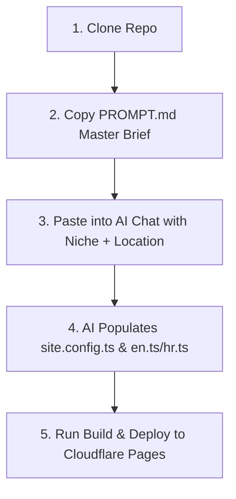

# Premium Local SEO Rank-and-Rent Boilerplate (Astro 4 + Tailwind CSS v4)

A production-grade, highly optimized, **config-driven static site generator** built with **Astro 4** and **Tailwind CSS v4**. This boilerplate is designed specifically for Rank-and-Rent workflows: clone, configure a single `site.config.ts` file, and deploy to create beautiful, $10k-quality local business websites for any niche + location combination.

With built-in support for dual-language setups (EN + HR), full JSON-LD schema coverage, dynamic sitemaps, dynamic robots.txt, and zero client-side JS runtime (for perfect Core Web Vitals), this boilerplate is fully prepared to be used by AI coding assistants (like Cursor, Claude, or Copilot) with the included `PROMPT.md` master brief.

---

## 🚀 The 30-Minute Clone & Launch Workflow

This boilerplate is designed for ultra-fast deployment. By combining a single-file configuration with AI-ready prompts, you can go from zero to a live, premium local business site in under 30 minutes:



1. **Clone the Repository:**
   ```bash
   git clone https://github.com/dafidkaa/local-seo-rank-rent-boilerplate.git my-niche-site
   cd my-niche-site
   npm install
   ```

2. **Configure Niche & Location:**
   - Open `PROMPT.md` in the root of the project.
   - Copy the entire prompt.
   - Paste it into **Cursor** (using Composer/Agent mode) or **Claude Projects**.
   - Specify your target **Niche** (e.g., Plumbing, Towing, Roofing, Dental), **Location** (e.g., Austin TX, Zagreb HR), and **Languages** (EN, HR, or both).

3. **AI Generation:**
   - The AI will read the corresponding niche design brief (e.g., `DESIGN-construction.md` for roofing, `DESIGN-beauty.md` for dental).
   - It will automatically rewrite `src/site.config.ts` and `src/i18n/en.ts` (and `hr.ts` if dual-language) with highly relevant, 1,500-word density, localized copywriting, and Unsplash photography URLs.

4. **Verify & Build:**
   ```bash
   npm run build
   ```
   The static build generates **140+ highly optimized pages** in seconds with **0 errors and 0 warnings**.

5. **Deploy:**
   - Connect the repository to **Cloudflare Pages** or **Vercel**.
   - Your premium local SEO site is live!

---

## 🛠️ Tech Stack & Architecture

| Technology | Purpose | Key Benefits |
|---|---|---|
| **Astro 4** | Static Site Generator (SSG) | HTML-first, ultra-fast builds, zero client-side JS runtime by default. |
| **Tailwind CSS v4** | Utility-First CSS Framework | Lightning-fast compilation, modern CSS-first configuration, native CSS variables. |
| **TypeScript** | Type-Safe Architecture | Safe refactoring, strict config auto-completion, and error-free build checks. |
| **Flat i18n System** | Dual-Language Translation | Flat JSON files (`en.ts`, `hr.ts`) easily populated by AI without nested syntax errors. |
| **Cloudflare Pages** | Hosting & CI/CD | Free global CDN hosting, instant edge cache, and automated GitHub deployments. |

---

## 🎨 Premium Component Suite ($10k Agency Quality)

Every component in this boilerplate has been meticulously redesigned to match the aesthetics of high-end custom web design firms:

*   **`HeroSlider.astro` (Homepage Hero):** A full-bleed, full-viewport slideshow with dark high-contrast overlays, bold display typography (Plus Jakarta Sans), trust badge pills, dual CTAs, and a sleek dot navigation system.
*   **`Hero.astro` (Inner Page Hero):** A compact, high-impact banner with a dark background photo overlay, integrated breadcrumbs inside a dark bottom bar, and a quick estimate form popup trigger.
*   **`ServiceCard.astro`:** Photo-rich cards featuring subtle hover zoom effects, card lifts, and bold amber "LEARN MORE" call-to-actions.
*   **`ProcessSection.astro`:** A dark charcoal-styled section displaying large amber numbered badges (`01`–`04`) connected by a continuous visual path to guide user reading.
*   **`FinalCta.astro`:** A split-layout section with a dark photo background on one side and a clean, high-converting 2-column white form card on the other.
*   **`EstimateForm.astro`:** A wide, modern 2-column lead form (never tall/narrow) that captures rich metadata (Page URL, Referrer URL, Timestamp) and supports webhook submission.
*   **`FormPopup.astro`:** A global modal popup triggered by any CTA button on the site. Includes GDPR consent checkboxes, links to privacy policies, and a hidden honeypot spam filter.
*   **`ReviewsSection.astro`:** A Google-style review widget rendering star ratings horizontally in rows, user avatars with initials, and localized Google "G" logos.
*   **`FaqSection.astro`:** Semantic `<details>` accordion designed for maximum GEO/AEO optimization, accepting both modern `{q, a}` and legacy `{question, answer}` formats.
*   **`Header.astro` & `Footer.astro`:** A sticky navigation header with an amber utility bar, active state indicators, and a clean 4-column footer containing barely-visible but fully crawlable links to `sitemap.xml`, `robots.txt`, and `llms.txt`.

---

## 📈 SEO, AEO, & GEO Features

This boilerplate is engineered from the ground up to rank on Google (SEO), Answer Engines (AEO like Perplexity/Claude), and Generative Search (GEO like Google SGE):

### 1. Rich Schema Coverage (JSON-LD)
Every page automatically injects precise structured data to establish topical authority:
*   **`LocalBusiness`**: Configured on home, about, and contact pages with `areaServed`, `openingHours`, and contact details.
*   **`Service`**: Configured on service and sub-service pages with provider links and service types.
*   **`FAQPage`**: Configured on any page containing FAQs, rendering questions and answers in Google search snippets.
*   **`HowTo`**: Embedded in the Process section to capture step-by-step rich results.
*   **`BreadcrumbList`**: Injected on all inner pages to establish clean hierarchical crawling.

### 2. Generative Engine Optimization (GEO) & Local Authority
*   **1,000–1,500 Word Content Density:** The homepage, service templates, and location templates are structured into content-rich sections to satisfy word-count requirements without creating unreadable walls of text.
*   **Dedicated Service Template (`[slug].astro`):** 11 sections covering "What is [Service]?", sub-service grids, common problems, benefits, process, and localized FAQs.
*   **Dedicated Location Template (`[location].astro`):** 12 sections covering local landmarks/knowledge, services available in that city, interactive Google Maps embeds, and internal linking grids.
*   **Contextual Internal Linking:** Automatically links related services, locations, and sub-services in grids and footers.
*   **AI Crawler Friendly:** Includes `public/llms.txt` and `public/llms-full.txt` to provide context-rich, structured feeds for AI search crawlers.

### 3. Technical SEO
*   **Self-Referencing Canonicals:** Injected dynamically on every route.
*   **Hreflang Alternates:** Auto-generated `<link rel="alternate">` tags for EN and HR locales, including `x-default`.
*   **Dynamic Sitemap & Robots.txt:** Injected via Astro endpoints (`/sitemap.xml`, `/robots.txt`) to ensure instant search console indexing.

---

## 📁 Directory Structure

```
├── src/
│   ├── site.config.ts             # 👈 SINGLE SOURCE OF TRUTH (Niche, stats, brand, locations, services)
│   ├── i18n/
│   │   ├── en.ts                  # Flat English UI strings (AI-populated)
│   │   ├── hr.ts                  # Flat Croatian UI strings (AI-populated)
│   │   └── index.ts               # Translation helper & ui() loader
│   ├── lib/
│   │   ├── routes.ts              # Route generators & t() helper
│   │   └── seo.ts                 # JSON-LD Schema generators & seo() meta builder
│   ├── styles/
│   │   └── global.css             # Tailwind v4 imports + CSS custom properties (Design Tokens)
│   ├── components/                # Reusable Astro components (Hero, Cards, Forms, Accordions)
│   ├── layouts/
│   │   └── BaseLayout.astro       # Root layout injecting design tokens, analytics, and FormPopup
│   └── pages/
│       ├── index.astro            # Root redirect to default locale
│       └── [lang]/
│           ├── index.astro        # 15-section high-density homepage (~1,050 words)
│           ├── [slug].astro       # 11-section service page template (~1,100 words)
│           ├── [location].astro   # 12-section location page template with Maps embed (~1,200 words)
│           ├── [parent]/[child].astro # Sub-service landing page template
│           ├── about.astro        # About page with stats & area pills
│           ├── contact.astro      # Contact page with interactive form
│           └── blog/
│               ├── index.astro    # Blog hub with category filters & search
│               └── [post].astro   # Blog post with sticky TOC, sidebar CTA, and related services
├── public/
│   ├── llms.txt                   # AI Crawler discovery index
│   └── llms-full.txt              # Detailed AI Crawler context file
├── PROMPT.md                      # 👈 MASTER AI PROMPT (Copy-paste into Cursor/Claude)
├── DESIGN-[niche].md              # 21 Niche design briefs (Home Services, Prefab Homes, Waterproofing, etc.)
```

---

## 🎨 Design Tokens & Brand Customization

Tailwind CSS v4 is configured via CSS custom properties in `src/styles/global.css`. When you update `site.config.ts`, Astro injects these brand colors directly into the root HTML element:

```typescript
// src/site.config.ts
brand: {
  primary:      "#0f172a", // Slate 900 (Main BG & Dark text)
  secondary:    "#1e293b", // Slate 800 (Secondary sections)
  accent:       "#f59e0b", // Amber 500 (Primary CTAs, numbers, highlights)
  accentDark:   "#d97706", // Amber 600 (CTA hovers)
  accentLight:  "#fef3c7", // Amber 100 (Soft background highlights)
  heroOverlay:  "rgba(15, 23, 42, 0.75)", // Dark overlay for readability
  fontDisplay:  "Plus Jakarta Sans, sans-serif",
  fontBody:     "DM Sans, sans-serif",
}
```

These tokens are mapped to custom Tailwind utility classes:
*   `bg-brand-primary` / `text-brand-primary`
*   `bg-brand-accent` / `text-brand-accent`
*   `hover:bg-brand-accent-dark`
*   `font-display` / `font-body`

---

## 🌍 i18n & Translation Workflow

The boilerplate features a dual-language translation architecture. All UI strings are stored in flat, easy-to-read files under `src/i18n/`:

*   `src/i18n/en.ts`: English translations
*   `src/i18n/hr.ts`: Croatian translations (structure must mirror `en.ts` exactly)

### AI-Friendly Translation Helpers
To make it incredibly easy for AI tools to edit and compile translations without throwing TypeScript strictness errors, the `t()` and `ui()` helper signatures have been optimized to accept standard `string` parameters:

```typescript
import { t } from "@/lib/routes";
import { ui } from "@/i18n";

// Safely resolves strings in JSX:
<h1>{t(siteConfig.business.primaryService, locale)}</h1>
<p>{ui("form.submit", locale)}</p>
```

---

## 📄 License

This boilerplate is licensed under the MIT License. You are free to clone, modify, and deploy it for as many commercial rank-and-rent or client projects as you wish.
